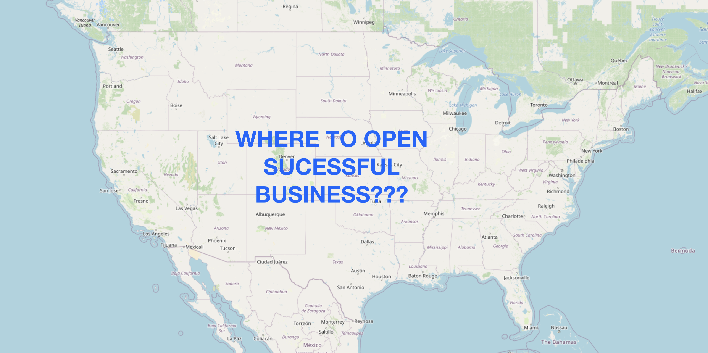
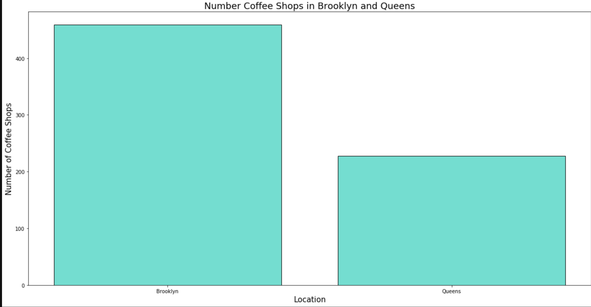
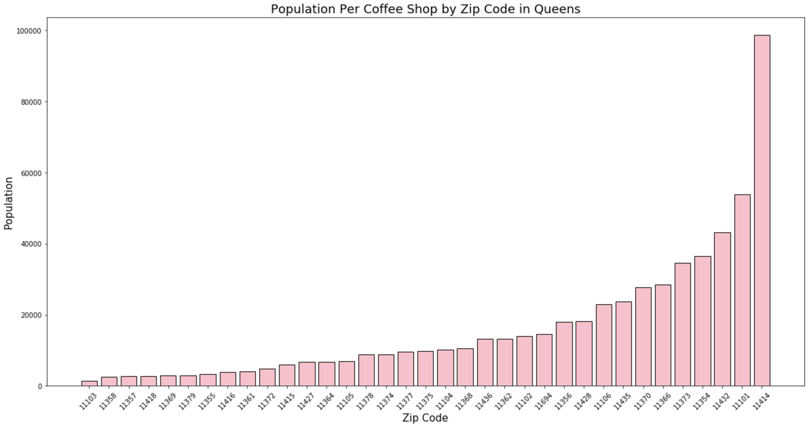
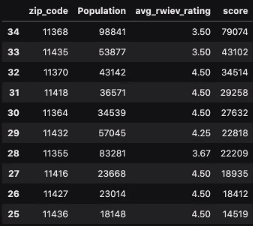

### Shop Zip Code Optimization

## Overview

This program is a designed to help prospective shop owners find a location that hues to their potential business plans

## Business Question:

Opening a store is a daunting endeavor. Opening a coffee shop in New York City has potential for being very lucrative, but there is a lot of competition vying for the millions of potential customers. Location is especially important since New Yorkers are both pretty picky, and want convenience. The business question we figure to answer with this program is to find areas of opportunity by using data science. More specifically our aim is to find places where there are plenty of possible customers and less competition.

## Repository Structure

All of the databases and pictures are stored in the /data folder

## Analysis Focus

1. Pull data from the Yelp API by looking for "Coffee Shop" in "Brooklyn" and "Queens"

2. Using census demographic data by zip code to further parse the shops. Source: http://zipatlas.com/us/ny/zip-code-comparison/population-density.html

3. The main focus of the results is to find the populations per business and average rating by zip code. Both factors are combined into a score based on weights given the importance of each factor determined by the operator of the program.

### Analysis

## Visualization of businesses in two boroughs - Brooklyn and Queens

By creating a map and placing a mark where each business is located one can better glean the distribution of coffee shops in the two boroughs. With the vast majority populating close to parks and rivers where the more affluent live.

## Visualizing exact differances - Brooklyn and Queens

The map itself doesn't give explicit data that we can use when it comes to understanding the geological implications, but it helps to point us in the right direction. We see that Brooklyn seems to have more markers and so we use our data and count the number of shops in each borough.

A short glance at the bar chart shows that Brooklyn has about twice as many coffee shops as Queens. Both boroughs are density populated, yet Queens has more upside when it comes to avoiding competition from other coffee shops compared to Brooklyn.

## Looking for Population per Coffee Shop in each zip code in Queens

Using web scraping techniques we are able to get population data, broken down by zip code, for all Queens residents. This allows us a new angle to approach our analysis. By combining our retrieved data from the Yelp API and applying specific columns to the census data we are able to produce a bar chart that shows Population per Coffee Shop within each Zip Code in Queens. The greater the population in a zip code, the fewer competing coffee shops are vying for the same customers.

## Further analyzing with a specific equation

Going further we can take the data from our reviews table and create a score of sorts that will combine population, the average business rating in that zip code, and allow them to be weighted to the interests of a prospective Coffee Shop owner. This further helps to pair down the information that adds more insight to the decision of which zip code to build a coffee shop.

## Summary 

Despite having millions of potential customers and a lot of locations to choose from our data helped us narrow down all of the many possibilities into a more narrow set of optimal spots. Our results suggest that if we were to setup a coffee shop in zip code 11368 we would have the least competition for the most potential customers. Also the average review rating of the existing coffee shops in that zip code show there is a lot of room for improvement as the zip code wide rating is only 3.5 out of 5.

Here is a link to our presentation:
https://docs.google.com/presentation/d/1uYLp9xI4ixXBdMgJkdyNImKlLVqzdyn9JjTTtsEWENY/edit#slide=id.gaad49ec1d2_0_37

In collaboration with:
Ivan Zakharchuk
GitHub - https://github.com/vanitoz
Guy Monahan
GitHub - https://github.com/GuyMonahan
